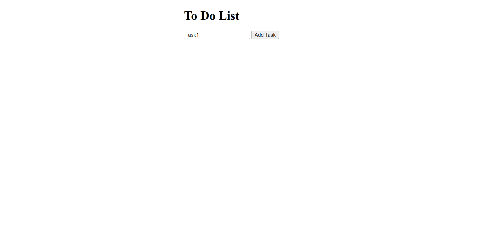
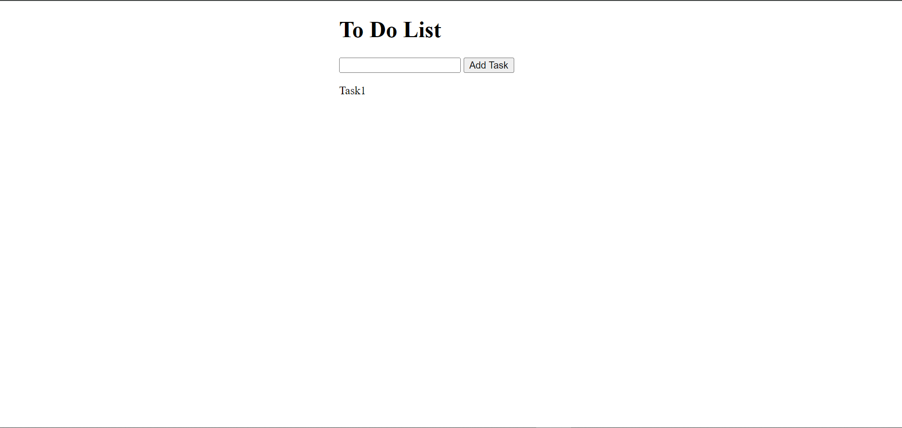
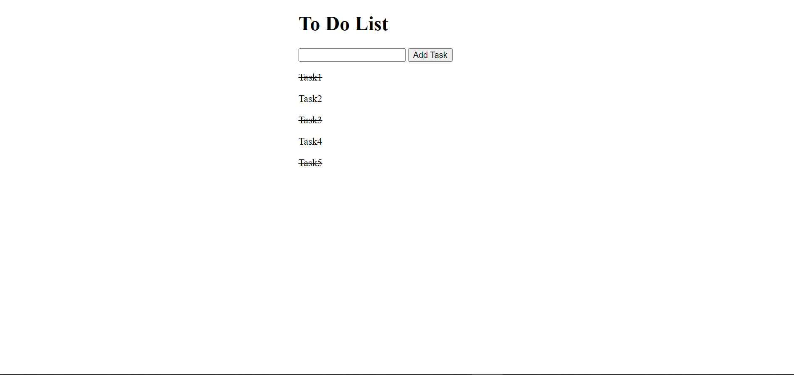

<h1>Description </h1>
This is a simple To-Do List application built with HTML, CSS, and JavaScript. It allows users to add, mark as complete, and remove tasks. When a task is added, it is displayed in a list. Users can click on a task to mark it as complete (with a line-through effect) or double-click to remove it from the list.

